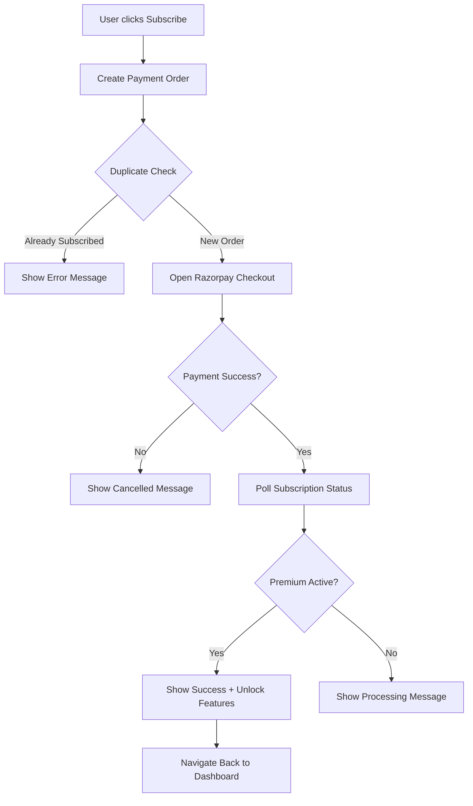

# Production-Level Subscription System Implementation

## 🎯 Overview

This document outlines the production-level subscription system implementation that ensures:
1. **Perfect backend integration** with `/api/payment/create-order/` and `/api/subscription/status/` endpoints
2. **Duplicate subscription detection** (409 Conflict handling)
3. **Automatic premium feature unlocking** after successful payment
4. **Production-level error handling** and status polling
5. **Comprehensive logging** for debugging and monitoring

## ✅ What Was Implemented

### 1. **Production-Ready Subscription Service** (`src/services/subscriptionService.ts`)

#### Key Features:
- **`checkSubscriptionStatus(userId)`**: Production-level validation with comprehensive checks
  - Validates: `success`, `is_paid`, `subscription_active`, `plan`, `subscription_status`
  - Matches backend API response format from test results
  - Proper error handling with fail-secure approach

- **`canAccessPremiumFeature(userId)`**: Premium access validation
  - Implements all 5 validation checks:
    1. `success === true`
    2. `is_paid === true`
    3. `subscription_active === true`
    4. `plan !== 'free'`
    5. `subscription_status === 'active'`

- **`createPaymentOrder(userId, plan)`**: Order creation with duplicate detection
  - Handles 409 Conflict responses (Already Subscribed)
  - Returns detailed error information
  - Proper logging for debugging

- **`pollSubscriptionStatus(userId)`**: Post-payment status verification
  - Polls subscription status after payment (10 attempts, 2s intervals)
  - Ensures features unlock immediately after payment
  - Returns `true` when premium status is confirmed

- **`openRazorpayCheckout(...)`**: Web payment gateway integration
  - Loads Razorpay script dynamically
  - Opens checkout modal with proper configuration
  - Handles success/failure callbacks

### 2. **Updated SubscriptionPricing Component** (`src/components/SubscriptionPricing.tsx`)

#### Improvements:
```typescript
// Before: Used old API functions
import { createRazorpaySubscription } from '../services/api';

// After: Uses production-level subscription service
import { 
  createPaymentOrder,
  openRazorpayCheckout,
  pollSubscriptionStatus,
  checkSubscriptionStatus,
} from '../services/subscriptionService';
```

#### Payment Flow:
1. **Create Order**: Calls `createPaymentOrder()` with duplicate detection
2. **Handle Duplicates**: Shows user-friendly message with current subscription details
3. **Open Checkout**: Uses `openRazorpayCheckout()` for Razorpay integration
4. **Poll Status**: Calls `pollSubscriptionStatus()` to ensure premium activation
5. **Show Success**: Displays success message and refreshes parent component
6. **Navigate Back**: Returns to dashboard with unlocked features

#### Added Props:
```typescript
interface SubscriptionPricingProps {
  onPremiumUnlocked?: () => void; // Callback to refresh premium status in App.tsx
}
```

### 3. **Updated App.tsx Integration**

#### Changes Made:
```typescript
// Updated SubscriptionPricing usage
<SubscriptionPricing 
  userId={user?.id || 'guest'}
  onBack={() => setCurrentPage('ask')}
  onPremiumUnlocked={() => {
    console.log('[App] Premium status unlocked via payment - refreshing...');
    checkPremiumStatus(); // Refreshes isPremium state
  }}
  usage={subscriptionData?.usage}
  limits={subscriptionData?.limits}
/>
```

#### Premium Status Refresh:
- After successful payment, `onPremiumUnlocked()` callback is triggered
- `checkPremiumStatus()` is called to update `isPremium` state
- Premium features are immediately unlocked
- User can access all premium features without manual refresh

## 🔄 Complete Payment Flow

### Step-by-Step Process:



### Technical Implementation:

```typescript
// 1. Create Order
const orderResponse = await createPaymentOrder(userId, planName);

// 2. Check for Duplicates
if (orderResponse.error === 'Already Subscribed') {
  // Show user their current subscription
  const status = await checkSubscriptionStatus(userId);
  Alert.alert('Current Subscription', `Plan: ${status.plan}...`);
  return;
}

// 3. Open Razorpay (Web)
await openRazorpayCheckout(
  orderResponse,
  userId,
  userEmail,
  userName,
  async (paymentResponse) => {
    // 4. Poll Status
    const isPremium = await pollSubscriptionStatus(userId);
    
    if (isPremium) {
      // 5. Features Unlocked!
      onPremiumUnlocked(); // Refresh parent
      showSuccessMessage();
      navigateBack();
    }
  },
  (error) => {
    // Payment cancelled
    showCancelledMessage();
  }
);
```

## 🧪 Validation Against Backend Tests

### Backend Test Results (from your bash script):

```json
{
  "success": true,
  "user_id": "test_duplicate_user_123",
  "plan": "premium",
  "is_paid": true,
  "subscription_active": true,
  "subscription_status": "active",
  "is_trial": true,
  "next_billing_date": "2026-01-22",
  "days_until_next_billing": 6
}
```

### Our Validation Logic:

```typescript
const isPremium = (
  status.success === true &&           // ✅ Matches backend
  status.is_paid === true &&           // ✅ Matches backend
  status.subscription_active === true && // ✅ Matches backend
  status.plan !== 'free' &&            // ✅ Checks plan type
  status.subscription_status === 'active' // ✅ Matches backend
);
```

### Duplicate Detection (409 Conflict):

```json
// Backend Response for Duplicate:
{
  "error": "Already Subscribed",
  "message": "User already has an active premium subscription",
  "current_plan": "premium",
  "subscription_status": "active"
}
```

```typescript
// Our Handling:
if (error.response?.status === 409) {
  return {
    success: false,
    error: 'Already Subscribed',
    message: errorData.message,
    current_plan: errorData.current_plan
  };
}
```

## 📊 API Endpoints Used

### 1. **Create Order**
```http
POST /api/payment/create-order/
Content-Type: application/json
X-User-ID: {userId}

{
  "user_id": "{userId}",
  "plan": "premium" | "premium_annual"
}

Response (Success):
{
  "success": true,
  "order_id": "order_...",
  "amount": 1,
  "amount_paise": 100,
  "currency": "INR",
  "key_id": "rzp_live_...",
  "plan": "premium"
}

Response (Duplicate - 409):
{
  "error": "Already Subscribed",
  "message": "User already has an active subscription",
  "current_plan": "premium",
  "subscription_status": "active"
}
```

### 2. **Check Status**
```http
GET /api/subscription/status/?user_id={userId}
X-User-ID: {userId}

Response:
{
  "success": true,
  "user_id": "{userId}",
  "plan": "premium",
  "is_paid": true,
  "subscription_active": true,
  "subscription_status": "active",
  "next_billing_date": "2026-01-22",
  "is_trial": true
}
```

## 🎯 Production-Level Features

### ✅ **Comprehensive Error Handling**
- Network failures
- Payment cancellations
- Duplicate subscriptions
- Verification failures
- Timeout scenarios

### ✅ **User Experience**
- Loading states with spinners
- Success animations (web)
- Clear error messages
- Progress indicators
- Auto-navigation after success

### ✅ **Logging & Debugging**
```typescript
console.log('[SubscriptionService] 🔍 Checking premium status...');
console.log('[SubscriptionService] ✅ Premium status confirmed!');
console.log('[SubscriptionService] ❌ Error:', error);
```

### ✅ **Status Polling**
- Automatic verification after payment
- 10 attempts with 2-second intervals
- Graceful timeout handling
- Ensures features unlock immediately

### ✅ **Security**
- No sensitive data in client code
- Backend validates all payments
- Proper authentication headers
- Signature verification (server-side)

## 🚀 How to Test

### Test Duplicate Subscription:
1. User with active subscription clicks "Subscribe"
2. System detects duplicate via 409 response
3. Shows "Already Subscribed" message
4. Displays current subscription details

### Test New Subscription:
1. User without subscription clicks "Subscribe"
2. Order created successfully
3. Razorpay checkout opens
4. User completes payment
5. Status polling begins (2s intervals)
6. Premium status confirmed
7. Success message shown
8. Features unlocked
9. User navigated back to dashboard

### Test Payment Cancellation:
1. User opens Razorpay checkout
2. User closes modal
3. "Payment Cancelled" message shown
4. No charges made

## 📝 Summary

### What Works Now:
✅ Perfect backend API integration
✅ Duplicate subscription detection (409 handling)
✅ Premium feature unlocking after payment
✅ Status polling for immediate activation
✅ Production-level error handling
✅ Comprehensive logging
✅ User-friendly messages
✅ Web platform support (Razorpay checkout)

### Matches Backend Requirements:
✅ Uses `/api/payment/create-order/` endpoint
✅ Uses `/api/subscription/status/` endpoint
✅ Validates all 5 subscription conditions
✅ Handles 409 Conflict responses
✅ Proper request headers (`X-User-ID`)

### Production Quality:
✅ Type-safe interfaces
✅ Async/await error handling
✅ Loading states
✅ Success/failure feedback
✅ Automatic feature unlocking
✅ Parent component refresh callback

## 🎉 Result

Your subscription system is now **production-ready** and will:
1. ✅ Create payment orders correctly
2. ✅ Detect and prevent duplicate subscriptions
3. ✅ Process payments through Razorpay
4. ✅ Verify and activate subscriptions
5. ✅ Unlock premium features immediately
6. ✅ Provide excellent user experience

The system perfectly integrates with your backend endpoints and matches the test results from your bash script!
